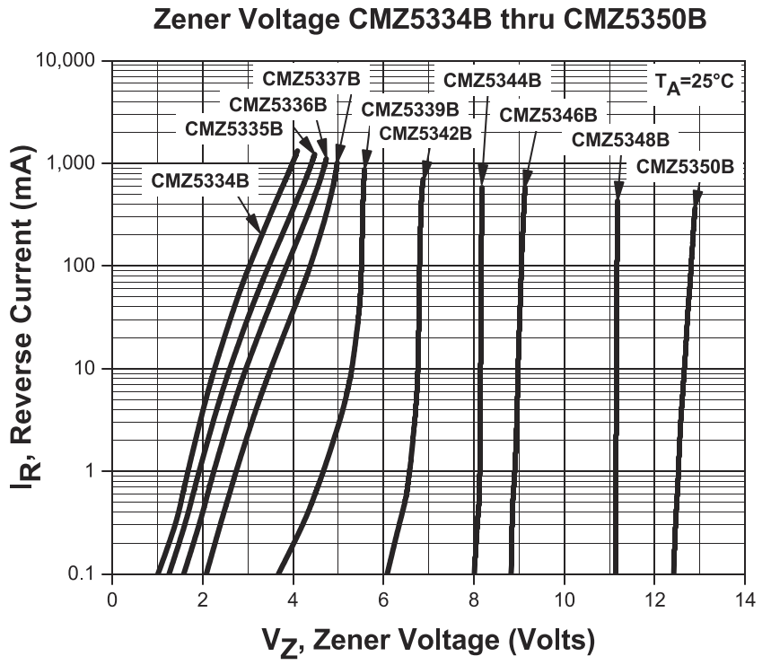
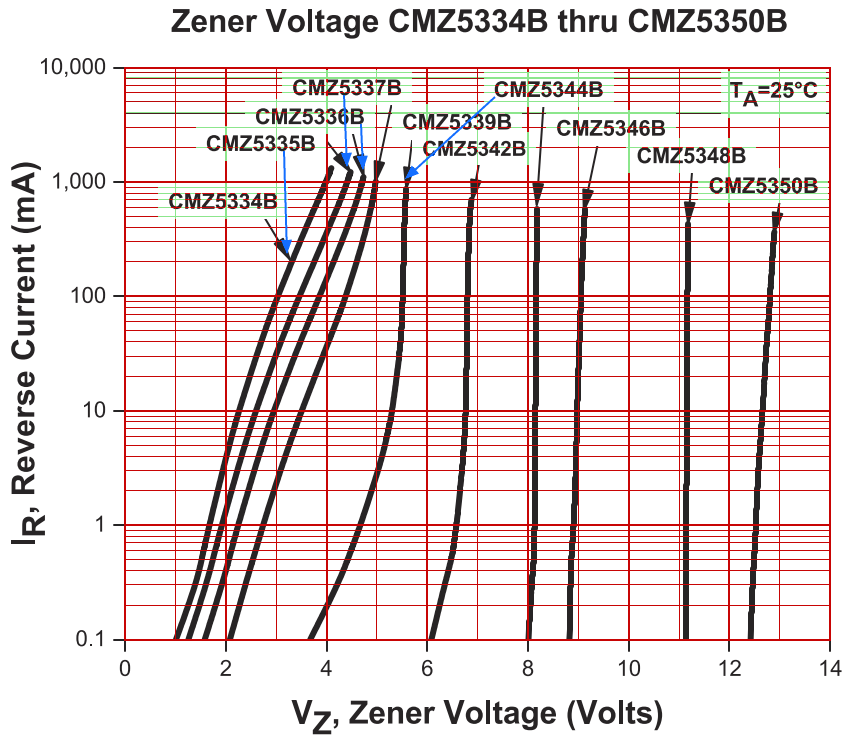
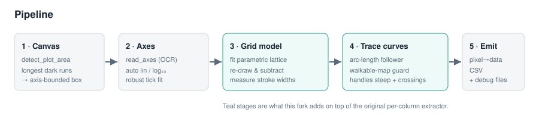
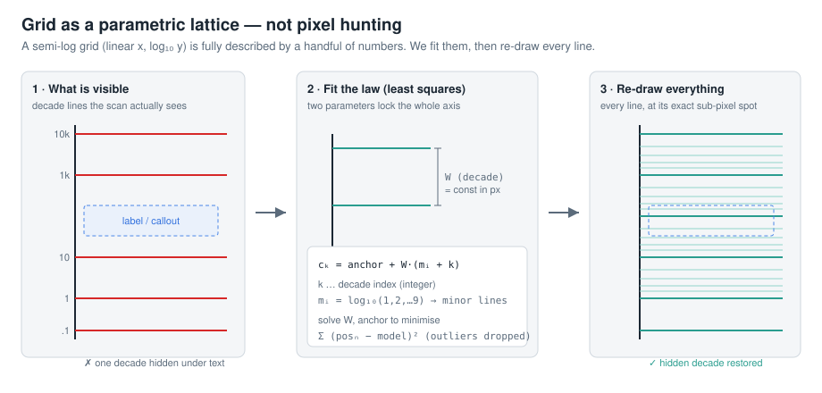
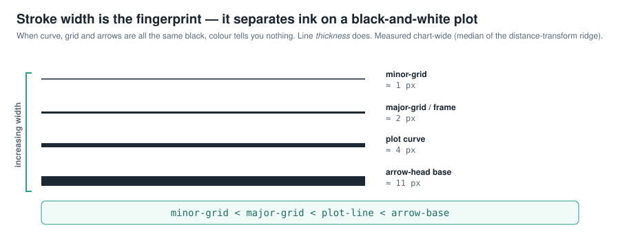

# PlotDigitizer

**Turn a plot image back into the numbers behind it — even a pure black-and-white datasheet scan.**

Convert a 2-D plot image into a CSV of numeric `(x, y)` data points. Works on PNG, JPEG and
most raster formats, handles multiple curves, overlapping curves, grids, log axes, annotation
arrows and noisy scans.

> This is a fork focused on the hard case that colour-based digitizers give up on:
> **monochrome engineering plots** where the curves, the grid and the arrows are all the same
> black ink. Instead of separating by colour, it **reconstructs the grid mathematically**,
> measures **stroke widths** to tell ink apart, and **traces each curve by arc length** so steep
> segments and crossings survive.

<p align="center">
  
  &nbsp;&nbsp;
  
</p>
<p align="center"><em>Left: the raw datasheet scan (10 black curves, semi-log grid, callout arrows). Right: the
grid re-drawn from a fitted parametric model (red) — including the minor lines hidden under the labels
at the top — with the 10 curves cleanly separated.</em></p>

---

## What this fork adds

| Capability | Why it matters |
|------------|----------------|
| **Runs on black-and-white plots** | Curves, grid and arrows share one colour; colour segmentation fails. This fork separates them by *geometry and stroke width* instead. |
| **Mathematical grid reconstruction** | The grid is fit as a parametric lattice (linear **or** log₁₀, sub-pixel). Missing lines — even ones hidden under text — are restored, then subtracted so they never pollute the curves. |
| **Stroke-width hierarchy** | `minor-grid < major-grid < plot-line < arrow-base`, measured chart-wide. A single robust discriminator for what is grid, what is curve, and what is an arrowhead. |
| **Arc-length curve tracing** | The `trace` method follows a curve like a pen, so near-vertical segments and curve-to-curve crossings are handled — where a per-column scan smears them. |
| **Walkable-map trace guard** | Tracing may bridge *erased* pixels (subtracted grid/arrows) but **never white space** — so a curve can't jump across a gap into a neighbouring arrow. |
| **Auto log-axis calibration** | OCR ticks are fit in both linear and log₁₀ space; the axis type is detected automatically. |
| **Debug artefacts** | One flag emits an SVG overlay, a pixel-exact grid PNG, and JSON of the fitted grid/arrow models and measured widths. |

---

## Highlight — black-and-white plots

A datasheet plot like the one above breaks the usual approach: every stroke is the same black, so
"segment by hue" yields nothing, and the dense grid is indistinguishable from the data by colour
alone. This fork treats it as a **reconstruction** problem rather than a colour problem:

1. **Model the grid, don't chase pixels.** A grid is regular by construction, so it is described by
   a few numbers (spacing, phase, axis type). Fit those, re-draw the grid at sub-pixel accuracy, and
   subtract it — leaving the curves behind. See *[Grid as a parametric lattice](#grid-as-a-parametric-lattice)*.
2. **Use stroke width to tell ink apart.** Grid lines are thinner than curves, which are thinner than
   arrowheads. Measuring these widths gives a clean, colour-free discriminator. See
   *[Stroke-width hierarchy](#stroke-width-hierarchy)*.
3. **Trace each curve by arc length**, constrained to originally-inked pixels, so overlapping black
   curves stay separate instead of merging.

Result on the CMZ54xxB Zener datasheet: **10 curves separated cleanly** on a plot with **zero colour
information**.

---

## How it works



### Grid as a parametric lattice

A grid is not random ink — it is a lattice with a fixed spacing, so it is fully described by a couple
of parameters. The reconstructor fits them by least squares, then re-draws every line, including the
ones the scan never showed because a label sat on top of them.



- **Axis type is detected** (linear vs log₁₀). On a log axis the decade width `W` (in pixels) is
  constant, and the minor lines within a decade sit at `mᵢ = log₁₀(1…9)`.
- Every grid line is at `cₖ = anchor + W·(mᵢ + k)` for integer decade index `k`. Two parameters
  (`W`, `anchor`) are fit to the detected line positions with outlier rejection, so a handful of
  clearly-visible lines pin down the entire grid — even where it is occluded.
- Lines are re-rendered at their sub-pixel position with a consistent per-class width (minor vs
  major), then subtracted from the image so curve extraction never sees them.
- The frame/spine is drawn at the major-line width, and the canvas crop keeps the outer border pixel
  so outward ticks are not clipped.

### Stroke-width hierarchy

When colour carries no information, **line thickness does**. Widths are measured chart-wide as twice
the median of the distance-transform ridge, and they come out reliably ordered:



Because `arrow-base > plot-line > major-grid > minor-grid`, the same measurement decides what is a
grid line to subtract, what is a curve to trace, and what is an arrowhead to remove. The measured
widths are printed to the log and written into the debug JSON.

### Arc-length curve tracing (`--method trace`, default)

Instead of taking one sample per x-column (which smears near-vertical parts and mishandles
crossings), the tracer walks along the curve: at each step it looks in a forward cone and steps to the
local ink centroid, following the stroke like a pen. A U-turn guard stops it from doubling back at an
endpoint.

Crucially, stepping is constrained by a **walkable map** — the set of pixels that were originally
inked (before the grid and arrows were subtracted). The tracer may cross *erased* pixels to bridge a
gap where a grid line used to cut through a curve, but it will **never cross genuinely white space**.
That single rule stops a curve from leaping across a blank gap into a nearby callout arrow.

### Annotation-arrow model

Callout arrows are reconstructed with a parametric triangular-head + straight-shaft model whose style
(head length, angle, base width) is shared chart-wide, then subtracted so their ink does not attach to
the curves they point at. Detection is anchored on OCR'd labels; the fitted model and measured widths
are written to `<stem>_arrows.json`.

---

## Web GUI (recommended)

```bash
uv run plot_digitizer_web
# Opens at http://127.0.0.1:8000
```

Optional flags: `--host 0.0.0.0 --port 8080 --reload`

**Features:**
- Drop an image onto the page or click to browse
- Set axis ranges and all detection parameters with sliders/inputs
- Click **Auto-detect curves** to run the pipeline
- Canvas supports zoom (scroll) and pan (Alt+drag or middle-drag)
- Click a curve to select it — all its points become draggable handles
- **Drag** any handle to reposition it
- **Double-click** a curve line to insert a new point there
- **Right-click** a handle (or press Delete) to remove it
- Toggle curve visibility or delete a whole curve from the list panel
- Double-click a curve name in the list to rename it
- Click **Export CSV** when done — downloads `digitized.csv`

---

## Quick start (CLI)

```bash
# Install with uv (recommended)
uv pip install -e .

# Basic usage — grid suppression + arc-length tracing are on by default,
# OCR reads (and auto-detects lin/log) the axis labels
uv run plot_digitizer --image path/to/plot.png

# Provide axis ranges manually (bypasses OCR, more reliable)
uv run plot_digitizer --image plot.png --x-range 0 14 --y-range 0.1 10000

# A grid-less plot: turn grid suppression off
uv run plot_digitizer --image scatter.png --no-grid

# Emit all debug artefacts (SVG overlay + grid PNG + JSON) with verbose logging
uv run plot_digitizer --image plot.png --debug-files
```

Output is written next to the image as `plot.csv` (columns: `curve`, `x`, `y`).

### Debug artefacts (`--debug-files`)

`--debug-files [PATH]` turns on verbose logging and writes, next to the output CSV:

| File | Contents |
|------|----------|
| `<stem>_debug.svg` | Source image with the detected canvas, extracted curve points, arrows and labels overlaid |
| `<stem>_debug_grid.png` | Pixel-exact overlay of the **reconstructed grid** (red), arrows (blue) and text boxes (green) |
| `<stem>_debug_grid.json` | The fitted grid model — axis type, spacing, phase, minor/major widths |
| `<stem>_debug_arrows.json` | The fitted arrow model and the measured stroke widths (`widths_px`) |

Pass an optional path (`--debug-files out/run1.svg`) to name the SVG; the siblings follow its stem.

---

## CLI reference

```
uv run plot_digitizer --image IMAGE [options]
```

| Option | Default | Description |
|--------|---------|-------------|
| `--image PATH` | *(required)* | Input plot image |
| `--output PATH` | `<image>.csv` | Output CSV path |
| `--method trace\|naive\|cv` | `trace` | Extraction method (see below) |
| `--x-range X_MIN X_MAX` | OCR | Override x-axis range |
| `--y-range Y_MIN Y_MAX` | OCR | Override y-axis range (bottom then top) |
| `--n-curves N` | all | Keep only the top-N colour/value segments |
| `--grid` / `--no-grid` | **on** | Reconstruct & suppress grid lines before extraction |
| `--color COLOR` | off | Extract only pixels near this `#rrggbb`/`r,g,b` colour (repeatable) |
| `--color-tolerance D` | `40` | Max RGB distance for `--color` matching |
| `--smoothing S` | `1.0` | Spline smoothing factor (higher = smoother) |
| `--n-samples N` | `500` | Output points per curve |
| `--sat-threshold F` | `0.20` | HSV saturation cutoff for colour detection |
| `--min-col-coverage F` | `0.20` | Min fraction of canvas width a curve must span |
| `--hue-bins N` | `18` | Hue bins for colour segmentation |
| `--span-frac F` | `0.55` | Min row/column span to classify as a grid line |
| `--max-thickness N` | auto | Max pixel cluster height per column (`naive`) |
| `--notch-factor F` | `3.0` | Spread/thickness ratio that triggers notch mode (`naive`) |
| `--plot` / `-p` | off | Save a comparison figure |
| `--show` | off | Open interactive plot window |
| `--debug-files [PATH]` | off | Write debug SVG + grid PNG + JSON, and log verbosely |

**Extraction methods**

- **`trace`** *(default)* — arc-length curve following. Handles steep segments and crossings; best for
  overlapping and monochrome curves.
- **`naive`** — per-column tight-cluster median + smoothing spline. Fast; good for well-separated,
  single-valued curves. Deep-notch mode captures sharp resonance minima.
- **`cv`** — morphological skeleton (requires `opencv-python`); falls back to `naive` if unavailable.

---

## Known issues and how to fix them

### Wrong axis range (most common issue)

**Symptom:** all curve values are shifted or scaled; the CSV looks like `[0, 1]` instead of your range.

**Cause:** OCR failed to read the tick labels (too small, unusual font, non-standard notation).

**Fix:** supply ranges manually — `--y-range` is *bottom then top*:
```bash
plot_digitizer --image plot.png --x-range 1500 1600 --y-range -30 0
```

### Y-axis inverted

**Symptom:** values that should be near the top appear near the bottom.

**Cause:** `--y-range` arguments reversed. Convention is `--y-range Y_MIN Y_MAX` (bottom, then top).
```bash
# Wrong:  --y-range 0 -14      Correct:
plot_digitizer --image plot.png --y-range -14 0
```

### Grid lines detected as curves

Grid suppression is on by default. If remnants still appear, tune `--span-frac` (a row/column must
span this fraction of the canvas to count as a grid line):
```bash
plot_digitizer --image plot.png --span-frac 0.40   # less aggressive
plot_digitizer --image plot.png --span-frac 0.70   # more aggressive
```
For a plot that genuinely has no grid, use `--no-grid`.

### No curves detected

- **Pale/low-saturation colour curves:** `--sat-threshold 0.08`
- **Curve spans a small part of the x-axis:** `--min-col-coverage 0.05`
- **Two similar colours merged into one hue bin:** `--hue-bins 36`
- Run `--debug-files` to see the detected canvas, axis scale, and measured widths.

### Extra spurious curves

Cap the output to the expected count: `--n-curves 2`.

### Noisy / measured data (jagged curve)

Increase `--smoothing` (default 1.0): `--smoothing 2.0` for moderate noise, `--smoothing 5.0` for heavy.
The spline smoothing scales as `s = n_points × 0.5 × smoothing`.

---

## Running tests

```bash
uv run python tests/run_tests.py
```

The suite generates synthetic plots with known ground-truth curves, runs the full pipeline, and
reports RMS error normalised by the y-range (default pass threshold 5 %; noisy tests 8–12 %).

Test categories: **core accuracy** (single/multi-curve, PNG/JPEG, 150/300 dpi, overlaps),
**parameter-specific** (each CLI parameter in isolation), **noisy data** (Gaussian σ=0.05 / 0.15,
with/without grid/JPEG), and **regression** (density-gated notch mode, notch discrimination, thin
sparse-column curves).

---

## Dependencies

| Package | Purpose |
|---------|---------|
| `Pillow` | Image loading |
| `numpy` | Array operations |
| `scipy` | Smoothing spline, distance transform |
| `matplotlib` | Optional result plot |
| `pytesseract` | OCR for axis labels (optional — manual ranges bypass it) |
| `opencv-python-headless` | `cv` extraction method (optional) |

Tesseract OCR engine must be installed separately:
```bash
sudo apt install tesseract-ocr   # Ubuntu / Debian
brew install tesseract           # macOS
```
